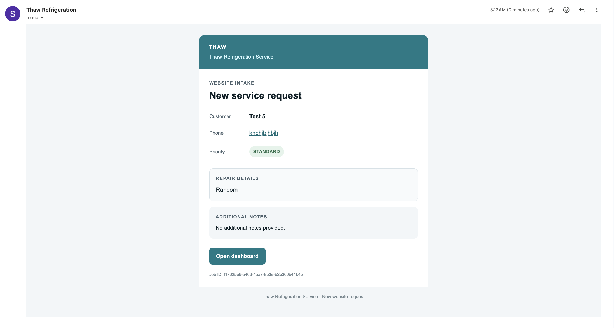

# Job Follow-up Dashboard

A lightweight job and lead tracker for Denise, who runs a commercial refrigeration repair company. It brings incoming requests into one dashboard and makes the next customer follow-up easy to see.

## What the app does

### Staff dashboard

- Sign in to a protected dashboard. The login page provides demo credentials for reviewers.
- Add jobs with the customer's name, phone, repair issue, lead source, urgency, estimated value, and notes.
- Track jobs through `new`, `waiting_on_quote`, `waiting_on_yes`, `scheduled`, and `done`.
- See stage counts and the total estimated value of open jobs.
- Search jobs by customer name, phone, or issue.
- Mark a customer contacted to reset the follow-up clock and save a contact-history entry.
- Use the responsive dashboard on desktop or mobile.

### Client request and email notification

Clients can use the public **Request service** form at `/request-service` without signing in. A successful submission is saved as a new job with source `website`, so it appears in the staff dashboard. The API then attempts to email the request details to `denisesmiththaw@gmail.com` using the configured SMTP account. The request remains saved if email delivery is unavailable or fails.

The notification contains the customer's contact details, urgency, repair description, notes, job ID, and a dashboard link. SMTP must be configured on the API for delivery.



### Call today

The dashboard's follow-up list is backed by PostgreSQL's `call_today` view. It includes:

- New jobs that have never been contacted.
- Jobs waiting on a quote.
- Jobs waiting on a customer response for at least two days.
- Other open jobs with no contact in at least two days.

Urgent jobs are ordered first. Each result includes a short reason, such as `New, never contacted` or `No contact in 3 days`.

## Technology

- **Database:** PostgreSQL
- **API:** Node.js, Express, and `pg`
- **Web:** React, Vite, Tailwind CSS, and Axios
- **Email:** Nodemailer over SMTP
- **Deployment:** Vercel for the web app; Render for the API; Neon PostgreSQL in the deployed setup

## Project structure

```text
.
├── db/
│   ├── migrations/       # Numbered PostgreSQL migrations
│   ├── seed.sql          # Demo jobs
│   └── README.md         # Database setup and query examples
├── server/
│   ├── src/              # Express API, database access, and email delivery
│   └── .env.example      # API environment variable template
├── web/
│   ├── src/              # React pages, components, styles, and API client
│   └── vercel.json       # API and client-side route rewrites
├── utils/
│   └── email_screenshot.png
└── README.md
```

## Run locally

### Requirements

- Node.js 20.19+ or 22.12+
- npm
- PostgreSQL, with `createdb` and `psql` available

### 1. Create and initialize the database

From the repository root:

```sh
createdb job_followup_dashboard_dev
psql -d job_followup_dashboard_dev -f db/migrations/001_init.sql
psql -d job_followup_dashboard_dev -f db/seed.sql
```

The migration creates job and contact-history tables, stage/source constraints, indexes, the `updated_at` trigger, and the `call_today` view. See [db/README.md](db/README.md) for additional checks. The checked-in migration does not create the authentication table or Denise's account; a fresh database needs those provisioned before sign-in will work.

### 2. Configure and start the API

Create a `.env` file in the repository root (or use `server/.env`) and set the database connection and session secret:

```env
DATABASE_URL=postgres://localhost:5432/job_followup_dashboard_dev
PORT=3000
AUTH_SECRET=replace-with-a-long-random-secret
CORS_ORIGIN=http://localhost:5173,https://lead-tracker-phi-seven.vercel.app

# Optional: configure these to send client request notifications.
SMTP_HOST=
SMTP_PORT=587
SMTP_SECURE=false
SMTP_USER=
SMTP_PASS=
SMTP_FROM_EMAIL=
```

Adjust `DATABASE_URL` for your local PostgreSQL credentials. `SMTP_FROM_EMAIL` defaults to `SMTP_USER`. The API loads environment values from the repository root and `server/.env`. For deployment, configure these variables in the API host's environment; do not commit real secrets.

Install the API dependencies and start the server:

```sh
npm install
npm run dev
```

The API listens on the configured `PORT` (the example uses `http://localhost:3000`). Visit `/health` to check API and database availability.

### 3. Start the web app

In a second terminal:

```sh
npm install --prefix web
npm run dev --prefix web
```

Open the local URL printed by Vite, usually `http://localhost:5173`. Vite proxies `/api` requests to `VITE_API_BASE_URL`, if set in `web/.env`; otherwise it uses `http://localhost:3000`. In production, the Vercel rewrite proxies `/api` to the deployed Render API. Set `CORS_ORIGIN` on the API to the frontend origin or comma-separated list of allowed origins.

## Demo sign-in

On the login page, select **Click here to get demo credentials** or use:

- **Email:** `denise@thaw.demo`
- **Password:** `ThawDemo2026!`

The deployed demo account is provisioned in Neon. Passwords are stored as scrypt hashes, and login sessions expire after eight hours. The checked-in database migration does not provision a demo account; a fresh local database needs its own authentication table and user before protected routes can be used.

## API overview

All `/api` endpoints require a session except `POST /api/public/intake` and the login/logout endpoints as indicated below.

| Method | Path | Access | Purpose |
| --- | --- | --- | --- |
| `GET` | `/health` | Public | Check API and database availability |
| `POST` | `/api/auth/login` | Public | Sign in and create a session cookie |
| `POST` | `/api/auth/logout` | Public | Clear the session cookie |
| `GET` | `/api/auth/session` | Signed in | Get the current user |
| `POST` | `/api/public/intake` | Public | Save a client service request and attempt an email notification |
| `GET` | `/api/jobs` | Signed in | List jobs; supports `stage`, `urgent`, `open`, and `q` filters |
| `POST` | `/api/jobs` | Signed in | Create a job manually |
| `GET` | `/api/jobs/:id` | Signed in | Get a job and its contact history |
| `PATCH` | `/api/jobs/:id` | Signed in | Update job fields |
| `POST` | `/api/jobs/:id/contact` | Signed in | Record contact and reset follow-up time |
| `GET` | `/api/call-today` | Signed in | Get follow-ups due today, with reasons and urgent-first ordering |
| `GET` | `/api/summary` | Signed in | Get stage counts and open estimated value |

Job stages are `new`, `waiting_on_quote`, `waiting_on_yes`, `scheduled`, and `done`. Lead sources are `office_call`, `website`, `text`, `referral`, and `other`.

## Useful commands

Build the web app:

```sh
npm run build --prefix web
```

Lint the web app:

```sh
npm run lint --prefix web
```

Inspect the follow-up view locally:

```sh
psql -d job_followup_dashboard_dev -c \
  "SELECT customer_name, phone, stage, urgent, days_since_contact, reason FROM call_today;"
```

The production build is written to `web/dist/`.
